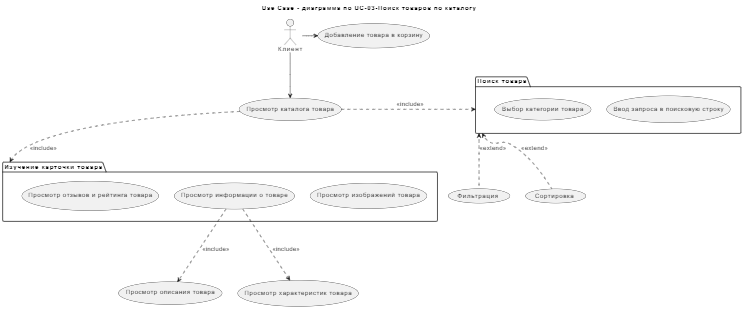
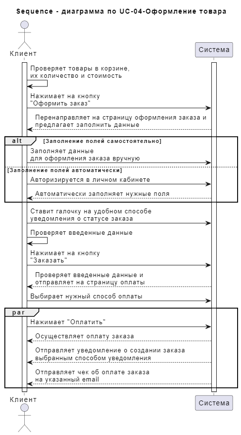
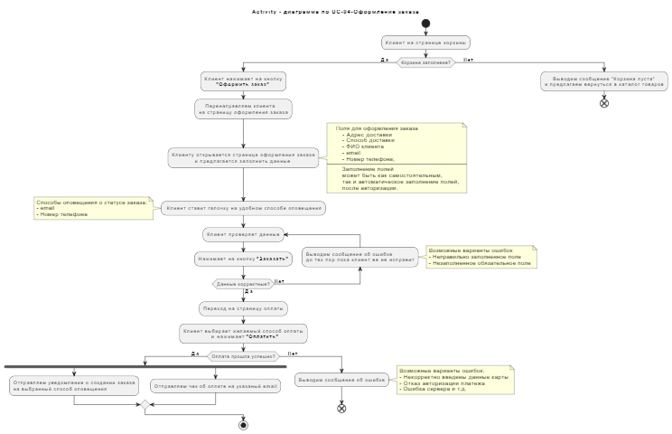

<h1 align="center">Домашнее задание №4</h1>
<h2 align="center">Подготовила Хван Ок Хи</h2>

## Оглавление
[1. Use Case - диаграмма по UС-03-Поиск товаров по каталогу]()

[2. Sequence - диаграмма по UC-04-Оформление товара]()

[3. Activity - диаграмма по UC-04-Оформление заказа]()

## Use Case - диаграмма по UС-03-Поиск товаров по каталогу

Код для PlantUML - [здесь](https://github.com/Ruugiko/Aston/blob/main/lesson_4/UseCase.plantuml)
## Sequence - диаграмма по UC-04-Оформление товара

Код для PlantUML - [здесь](https://github.com/Ruugiko/Aston/blob/main/lesson_4/Sequence.plantuml)
## Activity - диаграмма по UC-04-Оформление заказа

Код для PlantUML - [здесь](https://github.com/Ruugiko/Aston/blob/main/lesson_4/UseCase.plantuml)